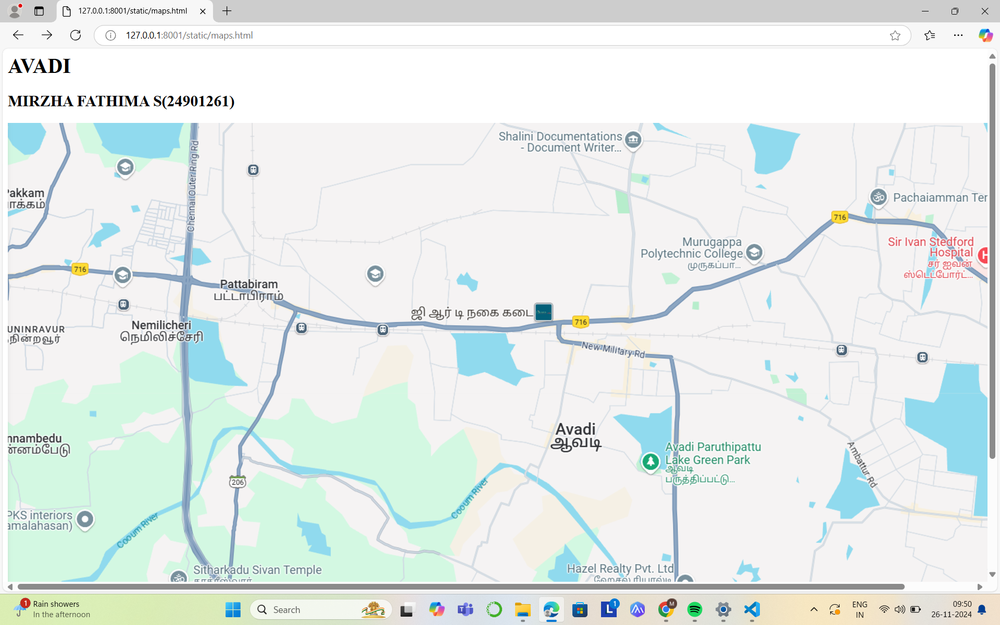
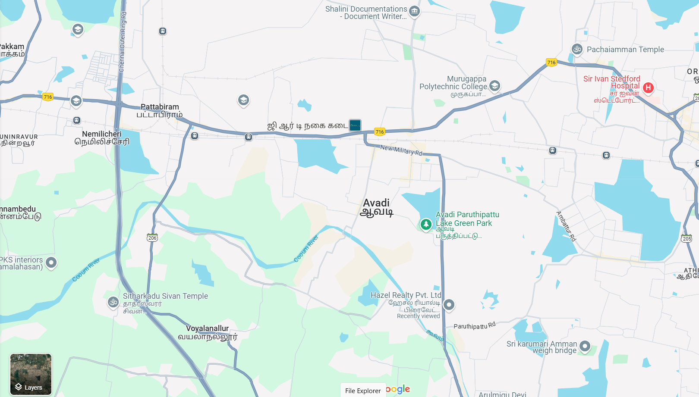
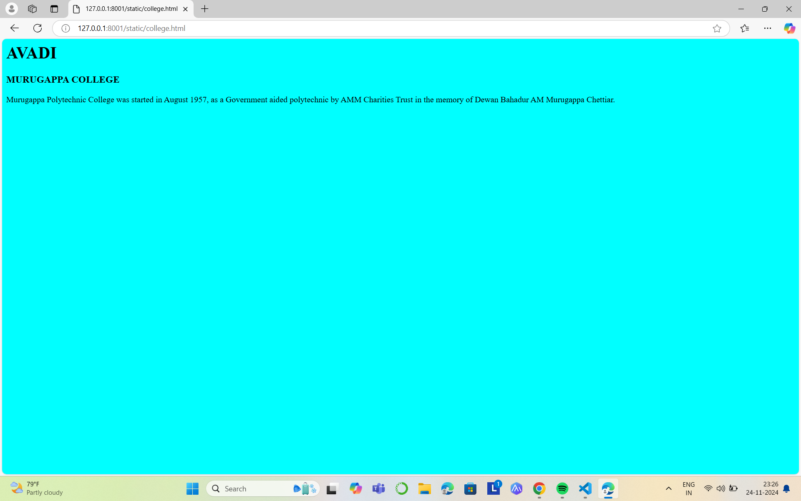
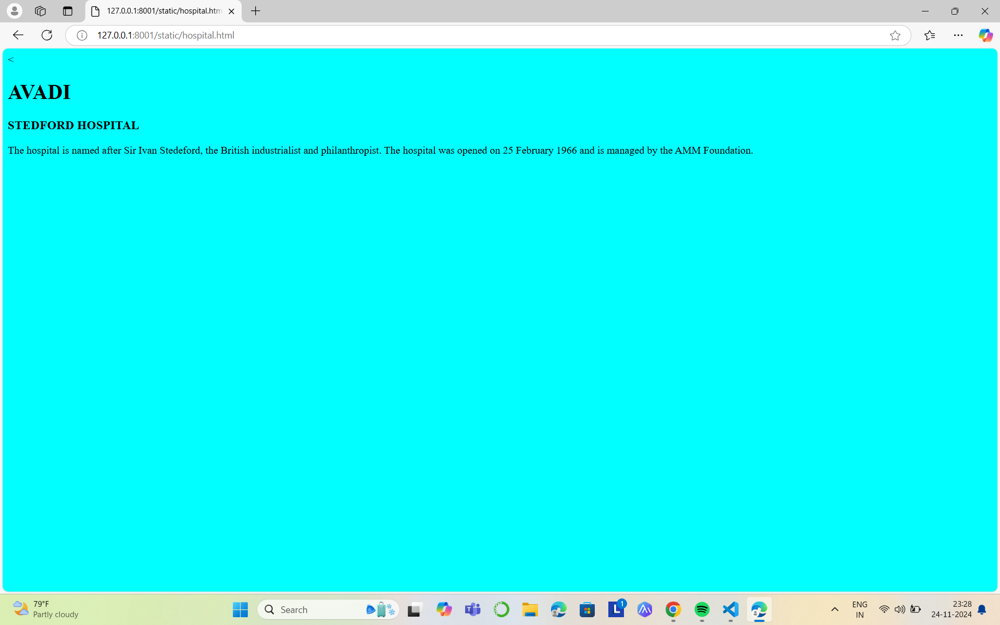
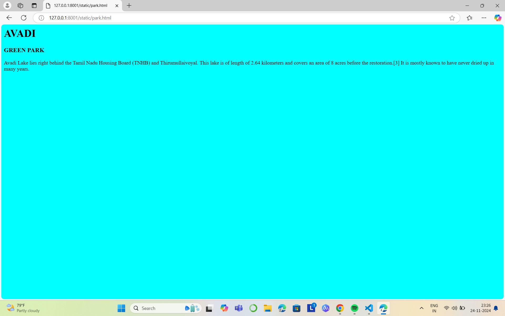
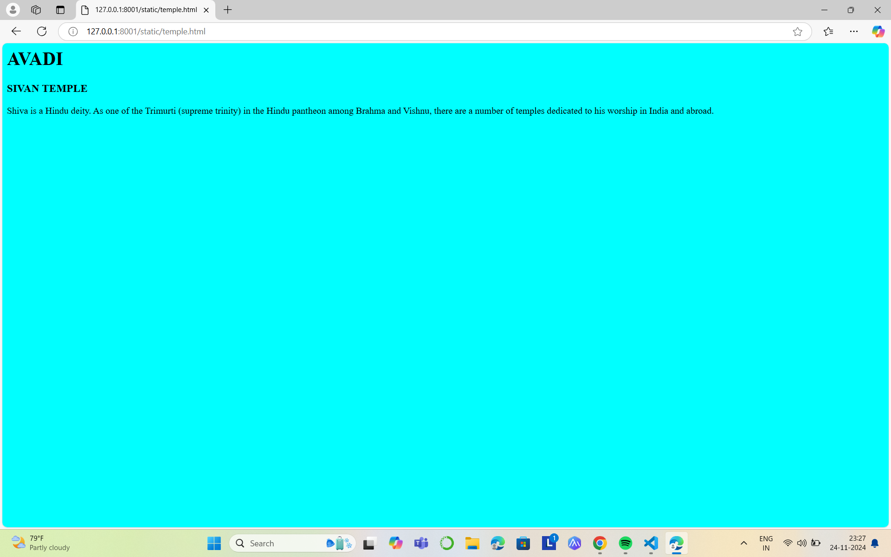

# Ex04 Places Around Me
## Date: 23.11.2024

## AIM
To develop a website to display details about the places around my house.

## DESIGN STEPS

### STEP 1
Create a Django admin interface.

### STEP 2
Download your city map from Google.

### STEP 3
Using ```<map>``` tag name the map.

### STEP 4
Create clickable regions in the image using ```<area>``` tag.

### STEP 5
Write HTML programs for all the regions identified.

### STEP 6
Execute the programs and publish them.

## CODE
```
map.html
<html>
    <body>
        <h1>AVADI</h1>
        <h2>MIRZHA FATHIMA S(24901261)</h2>


<map name="image-map">
    <area target="" alt="hazel appartment" title="hazel appartment" href="appartment.html" coords="1064,647,859,739" shape="rect">
    <area target="" alt="sivan temple" title="sivan temple" href="temple.html" coords="251,653,494,733" shape="rect">
    <area target="" alt="green park " title="green park " href="park.html" coords="966,463,1182,574" shape="rect">
    <area target="" alt="stedford hospital" title="stedford hospital" href="hospital.html" coords="1318,155,1554,254" shape="rect">
    <area target="" alt="murugappa college" title="murugappa college" href="college.html" coords="951,148,1196,235" shape="rect">
</map>

park.html

<html>
    <body bgcolor="cyan">
        <h1>AVADI</h1>
        <h3> GREEN PARK</h3>
        <p>
            Avadi Lake lies right behind the Tamil Nadu Housing Board (TNHB) and Thirumullaivoyal. This lake is of length of 2.64 kilometers and covers an area of 8 acres before the restoration.[3] It is mostly known to have never dried up in many years. 
        </p>

    </body>
</html>

temple.html

<html>
    <body bgcolor="cyan">
        <h1>AVADI</h1>
        <h3> SIVAN TEMPLE</h3>
        <p>
            Shiva is a Hindu deity. As one of the Trimurti (supreme trinity) in the Hindu pantheon among Brahma and Vishnu, there are a number of temples dedicated to his worship in India and abroad. 
        </p>

    </body>
</html>

hospital.html

<html>
    <body bgcolor="cyan">
        <h1>AVADI</h1>
        <h3>STEDFORD HOSPITAL</h3>
        <p>
            The hospital is named after Sir Ivan Stedeford, the British industrialist and philanthropist. The hospital was opened on 25 February 1966 and is managed by the AMM Foundation.
        </p>

    </body>
</html>

college.html

<html>
    <body bgcolor="cyan">
        <h1>AVADI</h1>
        <h3>MURUGAPPA COLLEGE</h3>
        <p>
            Murugappa Polytechnic College was started in August 1957, as a Government aided polytechnic by AMM Charities Trust in the memory of Dewan Bahadur AM Murugappa Chettiar. 
        </p>

    </body>
</html>

appartment.html

<html>
    <body bgcolor="cyan">
        <h1>AVADI</h1>
        <h3> Hazel Appartment</h3>
        <p>
            Hazel in Avadi, Chennai is a ready-to-move housing society. It offers apartments in varied budget range. These units are a perfect combination of comfort and style, specifically designed to suit your requirements and conveniences
        </p>

    </body>
</html>
```

## OUTPUT









## RESULT
The program for implementing image maps using HTML is executed successfully.
